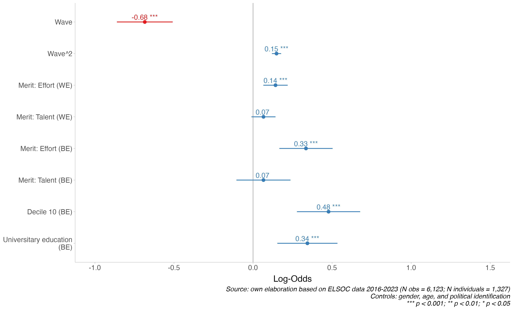

```{r}
#| echo: false
#| message: false
#| warning: false

library(knitr)
knitr::opts_chunk$set(echo = FALSE, 
                      include = TRUE, 
                      warning = FALSE, 
                      message = FALSE)

table_format <- if(is_html_output()) {
  "html"
} else if(is_latex_output()) {
  "latex"
}
table_format2 <- if(is_html_output()) {
  T
} else if(is_latex_output()) {
  F
}

options(kableExtra.html.bsTable = T)
options(knitr.kable.NA = "")
```


```{r}
#| include: false
#| echo: false
#| message: false

if (! require("pacman")) install.packages("pacman")

pacman::p_load(tidyverse, 
               sjmisc, 
               here, 
               performance,
               ordinal,
               texreg, 
               ggdist,
               sjlabelled,
               cowplot)


options(scipen=999)
rm(list = ls())
```


```{r}
#| echo: false
#| include: false

load(file = here("input/data/proc/df_balanced.RData"))

# Generate analytical sample

df_study1 <- df_balanced %>%
  select(-muestra) %>% 
  na.omit() %>% 
  mutate(ola = case_when(ola == 1 ~ 1,
                         ola == 2 ~ 2, 
                         ola == 3 ~ 3,
                         ola == 4 ~ 4,
                         ola == 6 ~ 5,
                         ola == 7 ~ 6)) %>% 
  mutate(ola = as.factor(ola),
         ola_num = as.numeric(ola),
         ola_2=as.numeric(ola)^2)

df_study1 <- df_study1 %>%
  group_by(idencuesta) %>%             # Agrupar por el identificador del participante
  mutate(n_participaciones = n()) %>%  # Contar el número de filas (participaciones) por participante
  ungroup()

df_study1 <- df_study1 %>% filter(n_participaciones>1)

# Corregir etiquetas

df_study1$just_pension <- sjlabelled::set_label(df_study1$just_pension, 
                        label = "Pension distributive justice")

df_study1$egp <- sjlabelled::set_label(df_study1$egp, 
                        label = "Social class")

df_study1$merit_effort <- sjlabelled::set_label(df_study1$merit_effort, 
                        label = "People are rewarded for their efforts")

df_study1$merit_talent <- sjlabelled::set_label(df_study1$merit_talent, 
                        label = "People are rewarded for their intelligence")

load(file = here("output/time_effects.RData"))
load(file = here("output/main_effects.RData"))
load(file = here("output/interactions_total.RData"))
load(file = here("output/interactions_direct.RData"))


```

# Results {background-color="#491106ff"}

## Models

```{r}
#| label: fig-model_time
#| fig-cap-location: bottom
#| fig-cap: "Changes across waves in market justice preferences in pensions"
#| fig-align: center
#| out-width: '90%'
#| fig-asp: 0.5
#| echo: false

sjPlot::plot_model(
  m1.1,
  type = "est",
  terms = c("ola2017","ola2018","ola2019","ola2022","ola2023"),
  axis.labels = c("Wave 2023","Wave 2022","Wave 2019","Wave 2018","Wave 2017"),
  transform = NULL,
  show.ci = TRUE,     # <— muestra intervalos
  ci.lvl  = 0.95,     # <— nivel de confianza
  show.values = TRUE,
  p.style = "stars",
  vline.color = "grey40",
  value.size = 4.5
) +
  scale_y_continuous(limits = c(-1,1.5))+
  labs(title = NULL,
       caption = "*** p < 0.001; ** p < 0.01; * p < 0.05") +
  theme_ggdist() +
  theme(legend.position = "top",
        plot.title = element_text(face = "bold"),
        text = element_text(size = 16),
        plot.caption = element_text(size = 10, face = "italic")) 


```

::: {style="font-size: 60%;"}
- ICC = 0.23 between, 0.77 within
::::


## Models

```{r}
#| label: fig-model_be_we_controls
#| fig-cap-location: bottom
#| fig-cap: "Main within- and between-person effects on market justice preferences in pensions"
#| fig-align: center
#| out-width: '90%'
#| fig-asp: 0.55
#| echo: false

sjPlot::plot_model(
  m6,
  type = "est",
  terms = c("ola_num","ola_2","egpIntermediate class (III+IV)","egpService class (I+II)","egpRetired or pensioner","egpUnemployed","egpPerforms unpaid tasks","merit_effort_cwc","merit_talent_cwc", "merit_effort_mean", "merit_talent_mean"),
  
   axis.labels = c("Merit: Talent (BE)",
                   "Merit: Effort (BE)",
                   "Merit: Talent (WE)",
                   "Merit: Effort (WE)",
                   "Performs unpaid tasks",
                   "Unemployed",
                   "Retired or pensioner",
                   "Service class (I+II)",
                   "Intermediate class (III+IV)",
                   "Wave^2",
                   "Wave"),
  transform = NULL,
  show.ci = TRUE,     # <— muestra intervalos
  ci.lvl  = 0.95,     # <— nivel de confianza
  show.values = TRUE,
  p.style = "stars",
  vline.color = "grey40",
  value.size = 4.5
) +
  scale_y_continuous(limits = c(-1,1.5))+
  labs(title = NULL, caption = "*** p < 0.001; ** p < 0.01; * p < 0.05") +
  theme_ggdist() +
  theme(legend.position = "top",
        plot.title = element_text(face = "bold"),
        text = element_text(size = 16),
        plot.caption = element_text(size = 10, face = "italic")) 
```
::: {style="font-size: 60%;"}
- All models control for: gender, age, educational level, and political identification

::::

## Models

```{r echo=FALSE, results='asis'}
#| label: fig-interaction1
#| fig-cap-location: bottom
#| fig-cap: "Predicted probabilities of pension market justice preferences by talent-based meritocratic perceptions and social class"
#| out-width: '100%'
#| fig-asp: 0.55

load(here("output/predicted_probabilities.RData"))

p1_agree <- p1 %>% filter(response.level == 4) 

p1 <- ggplot(p1_agree, aes(x = x, y = predicted, color = group, fill = group)) +
  #geom_ribbon(aes(ymin = conf.low, ymax = conf.high), alpha = 0.15, colour = NA) +
  geom_line(linewidth = 1) +
  scale_color_manual(values = c("#08306B", "#D7301F")) +
  scale_fill_manual(values  = c("#08306B", "#D7301F")) +
  labs(
    x = "Merit: Talent (within-person)",
    y = "Pr(Agree)",
    color = NULL, 
    fill = NULL,
    caption = "Estimates (95% CIs) using ELSOC 2016-2023 (N obs = 7,522; N individuals = 1,317).\nSource: authors’ calculations."
  ) +
  theme_ggdist() +
    theme(text = element_text(size = 12),
        legend.position = "top"
        )


p2_agree <- p2 %>% filter(response.level == 4) 

p2 <- ggplot(p2_agree, aes(x = x, y = predicted, color = group, fill = group)) +
  #geom_ribbon(aes(ymin = conf.low, ymax = conf.high), alpha = 0.15, colour = NA) +
  geom_line(linewidth = 1) +
  scale_color_manual(values = c("#08306B", "#D7301F")) +
  scale_fill_manual(values  = c("#08306B", "#D7301F")) +
  labs(
    x = "Merit: Talent (between-person)",
    y = "Pr(Agree)",
    color = NULL, 
    fill = NULL,
   caption = "Estimates (95% CIs) using ELSOC 2016-2023 (N obs = 7,522; N individuals = 1,317).\nSource: authors’ calculations."
  ) +
  theme_ggdist()+
  theme(text = element_text(size = 12),
        legend.position = "top"
        )

p1
```


## Preliminary conclusions

:::: {.incremental style="font-size: 120%;"}

1. **Time**: Preferences for market justice in pensions have increased in recent years in Chile

2. **Social class**: Higher social classes don't exhibit greater support for market justice in pensions than lower classes (H1) [@kerner_pension_2020; @busemeyer_welfare_2020; @lindh_public_2015]

3. **Meritocracy**: The belief that effort is rewarded is associated with higher support for market justice in pensions (H2a and H2b) [@castillo_perceptions_2025]

4. **Class × Meritocracy**: There is no evidence of an amplification effect (H3a/H3b)

::::

## Caveats

:::: {.incremental style="font-size: 120%;"}

- No evidence of class differences in support for pension market justice, but what about a more direct measure of stratification differences? 

- Meritocratic beliefs show a strong and consistent effect.  Yet, are measured in a highly reduced way, through effort and talent only  

- Next step: model meritocracy as a multidimensional construct  
  → [@castillo_multidimensional_2023]
::::


## The role of income and education

```{r}
#| label: fig-income
#| fig-cap: "Main within- and between-person effects on market justice preferences in pension"
#| fig-align: center
#| out-width: '90%'
#| fig-cap-location: bottom
library(knitr)
library(here)



```

