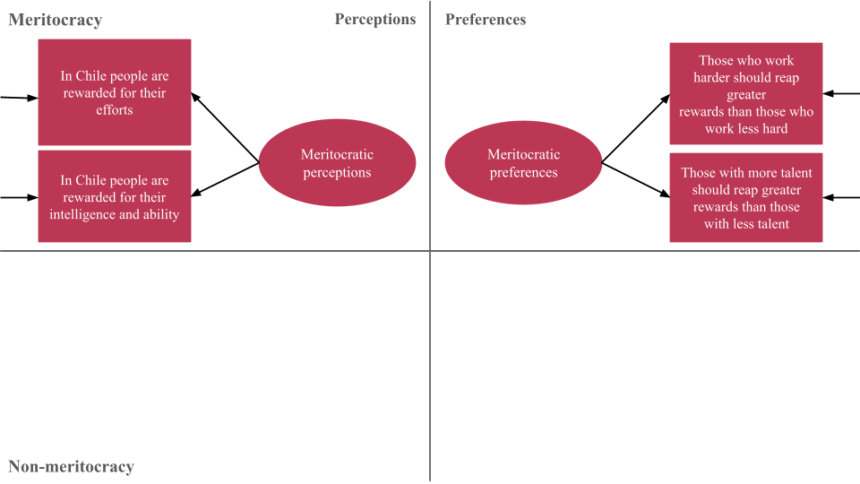
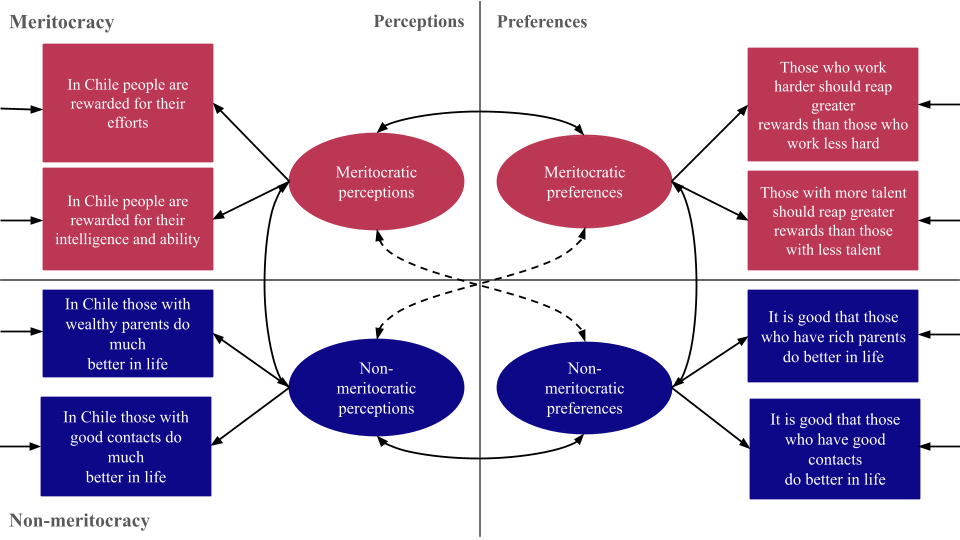
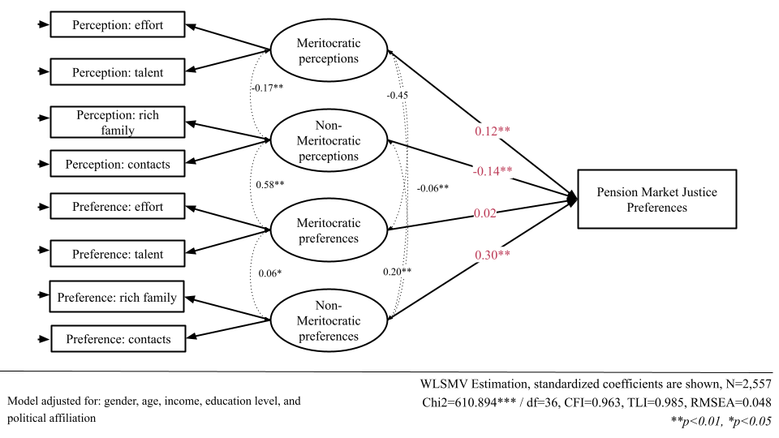

# Additional analyses (SEM) {background-color="#491106ff"}

```{r}
#| echo: false
#| include: false
library(here)
source("prod_analysis_sem.R")
```


## Data

:::: {.incremental style="font-size: 120%;"}

- EDUMERCO: Online survey (CAWI), fielded in 2025, with adult respondents from the Metropolitan Region of Chile  

- Non-probability sample with quota-based design  
    → approximating population parameters by age, gender, education, and socioeconomic status  

- Total sample: N = 3,470  

- Analytical sample: N = 2,557 

:::: 


## Measures

::: {.fragment}

```{r}
#| fig-cap: "Castillo et al. (2023) measurement model"
#| fig-align: center
#| out-width: '100%'
#| fig-cap-location: bottom
library(knitr)
library(here)

knitr::include_graphics("images/diagramas.png")

```

:::


## Measures


```{r}
#| fig-cap-location: bottom
#| fig-cap: "Castillo et al. (2023) measurement model"
#| fig-align: center
#| out-width: '100%'


knitr::include_graphics("images/diagramas(1).png")

```


## Measures


```{r}
#| fig-cap-location: bottom
#| fig-cap: "Castillo et al. (2023) measurement model"
#| fig-align: center
#| out-width: '100%'



```


## Measures


```{r}
#| fig-cap-location: bottom
#| fig-cap: "Castillo et al. (2023) measurement model"
#| fig-align: center
#| out-width: '100%'


knitr::include_graphics("images/diagramas(3).png")
```


## Measures


```{r}
#| fig-cap-location: bottom
#| fig-cap: "Castillo et al. (2023) measurement model"
#| fig-align: center
#| out-width: '100%'



```


## Analytical strategy

:::: {.incremental style="font-size: 120%;"}

- First, we estimate a Confirmatory Factor Analysis of the multidimensional meritocracy scale  
  → good model fit (CFI = 0.995, TLI = 0.991, RMSEA = 0.048)

- Second, we estimate a Structural Equation Model  
  → pension market justice regressed on latent meritocracy factors

::: {.fragment}
$$
\text{MJP}_{i} = \alpha + \beta_1 \eta^{PM}_{i} + \beta_2 \eta^{PNM}_{i} + \beta_3 \eta^{PrM}_{i} + \beta_4 \eta^{PrNM}_{i} + \gamma'X_i + \varepsilon_i
$$
:::

- Estimation: WLSMV  
  → appropriate for ordinal (Likert-type) data [@kline_principles_2023]

:::: 

# Results {background-color="#491106ff"}

## Descriptive

```{r}
#| label: fig-likermerit
#| fig-cap-location: bottom
#| fig-cap: "Distribution of responses on the scale of perceptions and preferences regarding meritocracy"
#| out-width: '90%'
#| echo: false
#| fig-asp: 0.6

likerplot 
```


## Model


```{r}
#| label: fig-sem
#| fig-align: center
#| out-width: '100%'
#| echo: false
#| fig-asp: 0.6
#| fig-cap-location: bottom
#| fig-cap: "Structural equation model"




```


## Preliminary conclusions

:::: {.incremental style="font-size: 120%;"}


1. **Meritocracy in Chile**: Privilege is perceived to outweigh merit, even though merit—especially effort—remains the dominant normative ideal

2. **Measuring meritocracy**: Respondents distinguish between perceptions and preferences, as well as between meritocratic and non-meritocratic principles

3. **Meritocracy and pension market justice**: Support is strongest among those willing to normalize privilege within a fair distributive order

::::