::: columns


::: {.column width="20%"}


  </br></br>


:::

::: {.column .column-right width="80%"}


# Market justice, meritocracy & deservingness {style="font-size:21px; text-align:right; line-height:1.1;"}

### **Agenda & work in progress**{style="font-size:35px; text-align:right; line-height:1.1; margin-top:12px;"}

------------------------------------------------------------------------

</br>
**Juan Carlos Castillo, Andreas Laffert & </br> Tomás Urzúa**

Project: [*Market Justice and Deservingness of Social Welfare*](https://jus-mer.github.io/web-proyecto/docs/) (ANID/FONDECYT N°1250518 2025-2028)

::: {.blue2 .medium style="line-height:0.4; margin-top:0; margin-bottom:0;"}

**Department of Sociology, University of Chile** </br>

:::

</br>

### Freie Universität Berlin - April 2026 {style="color:black"}

:::
:::

# Contents {data-background-color="#2f0202" style="text-align: right;"}

<div style="height: 100vh; display: flex; flex-direction: column; justify-content: center; align-items: flex-end; text-align: right;">

- [The project]{style="color: #fff; font-size: 1.3em;"}
- [Paper market justice in pensions]{style="color: #fff;font-size: 1.3em;"}
- [Paper factorial invariance of merit scale ]{style="color: #fff;font-size: 1.3em;"}
- [Latent Class Analysis of merit scale]{style="color: #fff;font-size: 1.3em;"}

</div>


# Contents {data-background-color="#2f0202" style="text-align: right;"}

<div style="height: 100vh; display: flex; flex-direction: column; justify-content: center; align-items: flex-end; text-align: right;">

- [The project]{style="color: #edde06; font-size: 1.3em;"}
- [Paper market justice in pensions]{style="color: #ab9f9f;font-size: 1.3em;"}
- [Paper factorial invariance of merit scale ]{style="color: #ab9f9f;font-size: 1.3em;"}
- [Latent Class Analysis of merit scale]{style="color: #ab9f9f;font-size: 1.3em;"}

</div>


## Project
::: {.columns}

::: {.column width="20%"}


:::

::: {.column width="80%"}
::: {.incremental .highlight-last style="font-size: 110%;"}
- ANID/FONDECYT N°1250518 2025-2028 - Market Justice and Deservingness of Social Welfare

- Objective: *Analyze market justice preferences in Chile, their evolution over time, and their relation to welfare deservingness*

- Main argument: *Chile’s highly commodified welfare system strengthens meritocratic deservingness beliefs, thereby increasing preferences for market justice relative to less commodified contexts*

- Research design:
  * Comparative and longitudinal data analysis
  * Original survey
  * Survey experiments
  * Legislative debates on pensions
:::
:::
:::

## Team {background-color="#491106ff"}

:::{=html}

<div style="display: grid; grid-template-columns: repeat(2, 1fr); gap: 20px; justify-items: center; align-items: center; margin-top: 20px;">

<div style="text-align: center;">
  
  <div>Juan Carlos Castillo (PI)</div>
</div>

<div style="text-align: center;">
  
  <div>Andreas Laffert (RA)</div>
</div>

<div style="text-align: center;">
  
  <div>Tomás Urzúa (RA)</div>
</div>

<div style="text-align: center;">
  
  <div>René Canales (RA)</div>
</div>

</div>

:::


## Agenda {style="font-size: 75%;"}

### Peer-reviewed Articles

::: {.box-inv-4 .sp-after .fragment}

- Castillo, J. C., Canales Sellés, R., Laffert, A., & Urzúa, T. (2026). Justification trajectories for pension inequality in Chile (2016–2023): the role of social class and beliefs in meritocracy. *Frontiers in Sociology*, 11, 1771856. [https://doi.org/10.3389/fsoc.2026.1771856](https://doi.org/10.3389/fsoc.2026.1771856)

:::

::: {.incremental}
- Castillo, J. C., Laffert, A., Carrasco, K., & Iturra-Sanhueza, J. (2025). Perceptions of inequality and meritocracy: their interplay in shaping preferences for market justice in Chile (2016–2023). Frontiers in Sociology, 10, 1634219. [https://doi.org/10.3389/fsoc.2025.1634219](https://doi.org/10.3389/fsoc.2025.1634219)


- Castillo, J. C., Salgado, M., Carrasco, K., & Laffert, A. (2024). The Socialization of Meritocracy and Market Justice Preferences at School. *Societies*, 14(11), 214. [doi.org/10.3390/soc14110214](https://doi.org/10.3390/soc14110214)

::: 
### Forthcoming

::: {.box-inv-4 .sp-after .fragment}

- Pensions’ market justice and meritocracy: A structural equation modeling approach. Andreas Laffert, Tomás Urzúa, Juan Carlos Castillo & René Canales.

:::

::: {.incremental}
- Stability and comparability of meritocratic beliefs in school-age students: A measurement invariance approach across time and cohorts. Andreas Laffert, Juan Carlos Castillo, René Canales, Tomás Urzúa & Kevin Carrasco. *Submited*.

- Inequality and deservingness in higher education in Chile. A conjoint survey experiment. Juan Carlos Castillo, Andreas Laffert, René Canales & Tomás Urzúa. 
:::


# Contents {data-background-color="#2f0202" style="text-align: right;"}

<div style="height: 100vh; display: flex; flex-direction: column; justify-content: center; align-items: flex-end; text-align: right;">

- [The project]{style="color: #ab9f9f; font-size: 1.3em;"}
- [Paper market justice in pensions]{style="color: #edde06;font-size: 1.3em;"}
- [Paper factorial invariance of merit scale ]{style="color: #ab9f9f;font-size: 1.3em;"}
- [Latent Class Analysis of merit scale]{style="color: #ab9f9f;font-size: 1.3em;"}

</div>

## The problem

::: {.box-inv-4 .sp-after .fragment style="font-size: 110%;"}

1) Privatization and marketization of public goods, welfare policies, and social services [@gingrich_making_2011; @streeck_how_2016]

:::

::: {.box-inv-4 .sp-after .fragment style="font-size: 110%;"}

2) Changes in the institutional architecture of the welfare state; expansion of market logics [@ferre_welfare_2023; @busemeyer_welfare_2020]

:::

::: {.box-inv-4 .sp-after .fragment style="font-size: 110%;"}

3) This economic order is reflected in a specific moral economy and policy feedback dynamics [@mau_inequality_2015; @campbell_institutional_2020; @fernandez_positive_2013]

:::

::: {.box-inv-5 .sp-after-half .fragment style="font-size: 110%;"}

Market justice preferences [@busemeyer_skills_2015; @castillo_perceptions_2025; @koos_moral_2019; @lindh_public_2015]

:::


## The Chilean case

::: {.incremental .highlight-last style="font-size: 110%;"}

- Economic growth alongside high inequality [@llorca-jana_historia_2021; @flores_top_2020]
- Rigid relative mobility and strong closure at the top [@lopez-roldan_comparative_2021; @torche_intergenerational_2014]
- Deep privatization and commodification of social reproduction domains, combined with strong state dependence [@madariaga_three_2020; @boccardo_30_2020]
- Pensions: an **individual capitalization** system administered by **private pension funds (AFPs)**; covers ~11 million contributors, but **27% of the labor force** remains excluded due to **informality** [@superintendencia_cuadros_2025]
- Pension-related social conflict [@somma_no_2021] and contested system legitimacy ("not with my money") [@castillo_perceptions_2025; @canalesceron_sujeto_2021]

:::


## Market justice preferences

::: {.incremental .highlight-last style="font-size: 120%;"}

- Lane [-@lane_market_1986]: market justice vs. political justice

- Normative beliefs that legitimize the idea that access to essential social services—such as healthcare, education, or pensions—should be determined by market-based criteria [@lindh_public_2015, p.895]

- Measurement: assessing whether individuals consider it fair that access to these services depends on income [@lindh_public_2015; @kluegel_legitimation_1999; @castillo_perceptions_2025]

:::


## Factors associated with market justice


::::: columns
::: {.column width="50%" .incremental .highlight-last style="font-size: 110%;"}
### Individual

- Socioeconomic status—income, education, and occupation [@lindh_public_2015; @koos_moral_2019; @busemeyer_welfare_2020; @svallfors_political_2007]
- Perceptions of inequality and meritocracy [@castillo_perceptions_2025]
- Economic conservatism/liberalism [@lee_fairness_2024]

:::

::: {.column width="50%" .incremental .highlight-last style="font-size: 110%;"}
### Contextual

- Social spending [@immergut_it_2020; @busemeyer_skills_2015; @busemeyer_welfare_2020]
- Economic inequality [@koos_moral_2019]
- Degree of privatization and market regulation [@lindh_public_2015; @koos_moral_2019]

:::
:::::


## This study

</br>

::: {.pull-left .box-inv-5 .sp-after .fragment style="font-size: 125%;"}

Analyze the relationship between social class and preferences for market justice in pensions in Chile, and how these evolve over time

:::

</br></br></br>

::: {.pull-right .box-inv-5 .sp-after .fragment style="font-size: 125%;"}

Examine the role of meritocracy in shaping the relationship between class and preferences for pension market justice

:::

## Hypotheses


::: {.fragment}


::: {.cell .fig-cap-location-bottom layout-align="center"}
::: {.cell-output-display}
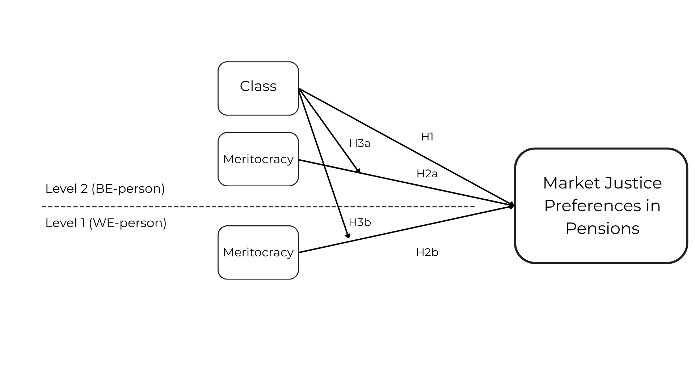{#fig-esque0 fig-align='center' width=100%}
:::
:::


:::


---
output: html_document
editor_options: 
  chunk_output_type: console
---


# Methodology {background-color="#491106ff"}

## Data

::: {.incremental .highlight-last style="font-size: 120%;"}

- [ELSOC (COES)](https://coes.cl/elsoc/): a representative panel survey of the urban adult population in Chile, based on a probabilistic, stratified, clustered, and multistage sampling design across large and small cities

- Period: six waves (2016, 2017, 2018, 2019, 2022, and 2023)

- Attrition 2016→2023: ~ 40%

- Analytical sample (**balanced 6-wave panel**): 

    * **N = 7,522 observations** (level 1) nested within 
    * **N = 1,317 individuals** (level 2)

:::


## Dependent variable

::: {.incremental style="font-size: 100%;"}

- Item: **¿"It is fair that people with higher incomes have better pensions than people with lower incomes?"**

:::

::: {.fragment}


::: {.cell .fig-cap-location-bottom layout-align="center"}
::: {.cell-output-display}
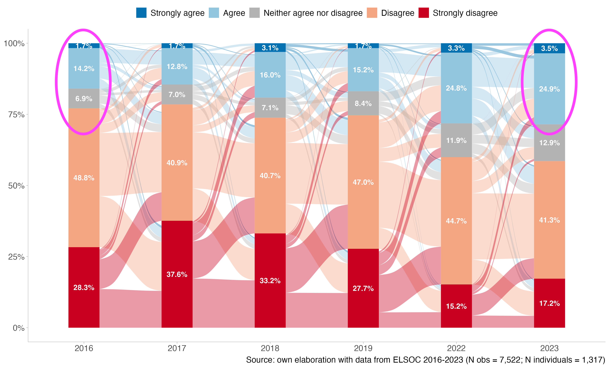{#fig-desc fig-align='center' width=85%}
:::
:::


::: 


## Independent variables: Level 1


::: {.cell .fig-cap-location-bottom layout-align="center"}
::: {.cell-output-display}
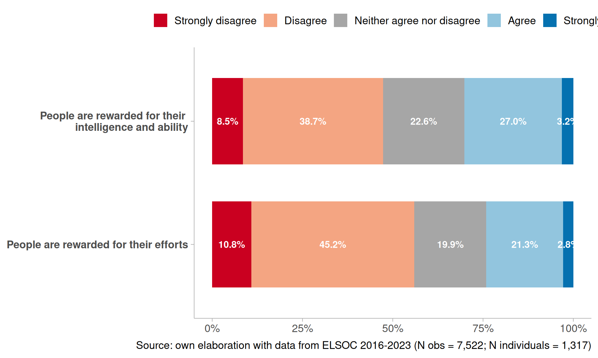{#fig-merit fig-align='center' width=90%}
:::
:::


## Independent variables: Level 2


::: {.cell .fig-cap-location-bottom layout-align="center"}
::: {.cell-output-display}
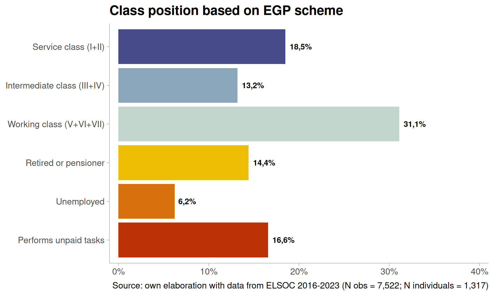{#fig-class fig-align='center' width=90%}
:::
:::


    
- Fixed at the first wave (i.e., time-invariant) → captures average between-person differences (BE = $\bar X_{i}$)


## Estimation strategy

:::: {.incremental style="font-size: 110%;"}

**Cumulative link mixed models (CLMM)**:

- Panel structure: repeated observations (level 1) nested within individuals (level 2)

- Models both _within-person_ (WE) and _between-person_ (BE) effects; includes random effects (intercept and time slope) 

- WE/BE decomposition (person-mean centering) [@bell_fixed_2019]: 

     * Within: $X^{WE}_{it}= X_{it}-\bar{X}_i$
     * Between: $X^{BE}_{i}=\bar{X}_i$

- Formally:  

::: {.fragment}
$$\begin{aligned}
\eta_{it} = \beta_{0}+ \beta_{1}\,\text{Time}_{it} +\beta_2\,\text{Meritocracy}^{WE}_{it} +\beta_3\,\text{Meritocracy}^{BE}_{i} +\beta_4\,\mathrm{Class}^{BE}_i +
    \end{aligned}$$
    
$$\beta_5\,(\mathrm{Class}^{BE}_i\!\times\! \text{Meritocracy}^{WE}_{it}) +\beta_6\,(\mathrm{Class}^{BE}_i\!\times\! \text{Meritocracy}^{BE}_{i}) +u_{0i}+u_{1i}\,\text{Time}_{it}\\$$
:::

::::


---
output: html_document
editor_options: 
  chunk_output_type: console
---

::: {.cell}

:::


# Results {background-color="#491106ff"}

## Models


::: {.cell .fig-cap-location-bottom layout-align="center"}
::: {.cell-output-display}
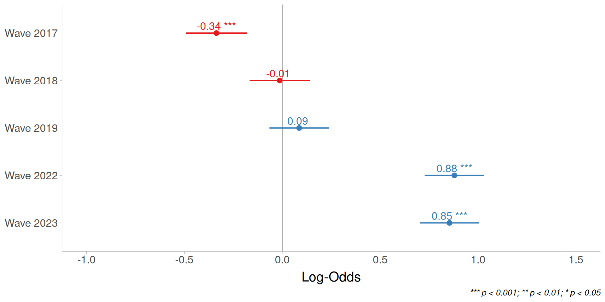{#fig-model_time fig-align='center' width=90%}
:::
:::


::: {style="font-size: 60%;"}
- ICC = 0.23 between, 0.77 within
::::


## Models


::: {.cell .fig-cap-location-bottom layout-align="center"}
::: {.cell-output-display}
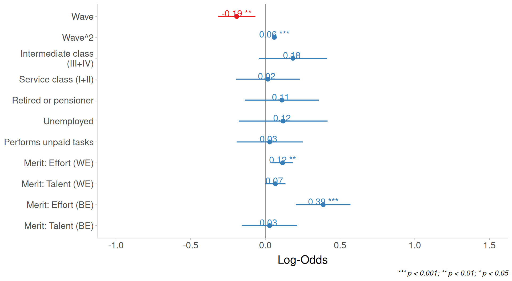{#fig-model_be_we_controls fig-align='center' width=90%}
:::
:::

::: {style="font-size: 60%;"}
- All models control for: gender, age, educational level, and political identification

::::

## Models


::: {.cell .fig-cap-location-bottom}
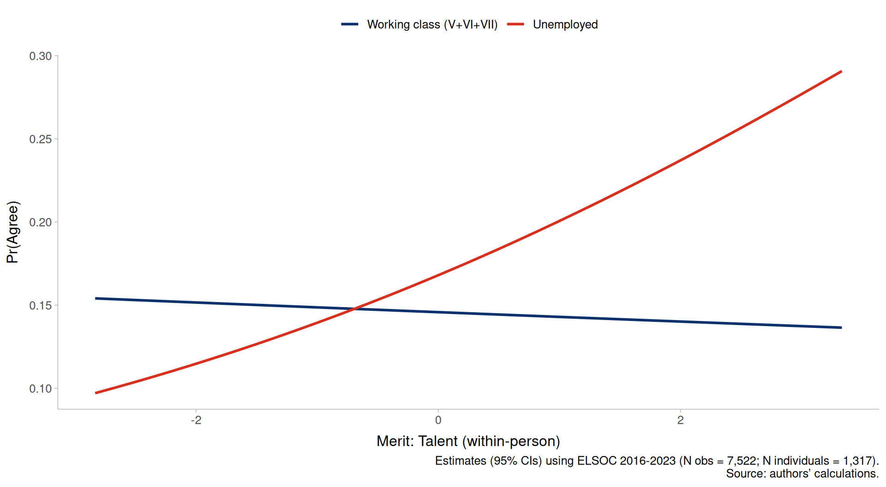{#fig-interaction1 width=100%}
:::


## Preliminary conclusions

:::: {.incremental style="font-size: 120%;"}

1. **Time**: Preferences for market justice in pensions have increased in recent years in Chile

2. **Social class**: Higher social classes don't exhibit greater support for market justice in pensions than lower classes (H1) [@kerner_pension_2020; @busemeyer_welfare_2020; @lindh_public_2015]

3. **Meritocracy**: The belief that effort is rewarded is associated with higher support for market justice in pensions (H2a and H2b) [@castillo_perceptions_2025]

4. **Class × Meritocracy**: There is no evidence of an amplification effect (H3a/H3b)

::::

## Caveats

:::: {.incremental style="font-size: 120%;"}

- No evidence of class differences in support for pension market justice, but what about a more direct measure of stratification differences? 

::::


## The role of income and education


::: {.cell .fig-cap-location-bottom layout-align="center"}
::: {.cell-output-display}
{#fig-income fig-align='center' width=90%}
:::
:::


## Caveats

:::: {.incremental style="font-size: 120%;"}


- Meritocratic beliefs show a strong and consistent effect.  Yet, are measured in a highly reduced way, through effort and talent only  

- Next step: model meritocracy as a multidimensional construct  
  → [@castillo_multidimensional_2023]
::::


---
output: html_document
editor_options: 
  chunk_output_type: console
---
# Additional analyses (SEM) {background-color="#491106ff"}


## Data

:::: {.incremental style="font-size: 120%;"}

- EDUMERCO: Online survey (CAWI), fielded in 2025, with adult respondents from the Metropolitan Region of Chile  

- Non-probability sample with quota-based design  
    → approximating population parameters by age, gender, education, and socioeconomic status  

- Total sample: N = 3,470  

- Analytical sample: N = 2,557 

:::: 


## Measures

::: {.fragment}


::: {.cell .fig-cap-location-bottom layout-align="center"}
::: {.cell-output-display}
{fig-align='center' width=100%}
:::
:::


:::


## Measures


::: {.cell .fig-cap-location-bottom layout-align="center"}
::: {.cell-output-display}
.png){fig-align='center' width=100%}
:::
:::


## Measures


::: {.cell .fig-cap-location-bottom layout-align="center"}
::: {.cell-output-display}
.png){fig-align='center' width=100%}
:::
:::


## Measures


::: {.cell .fig-cap-location-bottom layout-align="center"}
::: {.cell-output-display}
.png){fig-align='center' width=100%}
:::
:::


## Measures


::: {.cell .fig-cap-location-bottom layout-align="center"}
::: {.cell-output-display}
.png){fig-align='center' width=100%}
:::
:::


## Analytical strategy

:::: {.incremental style="font-size: 120%;"}

- First, we estimate a Confirmatory Factor Analysis of the multidimensional meritocracy scale  
  → good model fit (CFI = 0.995, TLI = 0.991, RMSEA = 0.048)

- Second, we estimate a Structural Equation Model  
  → pension market justice regressed on latent meritocracy factors

::: {.fragment}
$$
\text{MJP}_{i} = \alpha + \beta_1 \eta^{PM}_{i} + \beta_2 \eta^{PNM}_{i} + \beta_3 \eta^{PrM}_{i} + \beta_4 \eta^{PrNM}_{i} + \gamma'X_i + \varepsilon_i
$$
:::

- Estimation: WLSMV  
  → appropriate for ordinal (Likert-type) data [@kline_principles_2023]

:::: 

# Results {background-color="#491106ff"}

## Descriptive


::: {.cell .fig-cap-location-bottom}
::: {.cell-output-display}
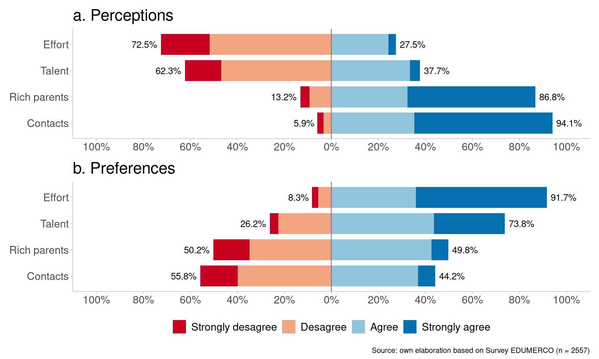{#fig-likermerit width=90%}
:::
:::


## Model


::: {.cell .fig-cap-location-bottom layout-align="center"}
::: {.cell-output-display}
{#fig-sem fig-align='center' width=100%}
:::
:::


## Preliminary conclusions

:::: {.incremental style="font-size: 120%;"}


1. **Meritocracy in Chile**: Privilege is perceived to outweigh merit, even though merit—especially effort—remains the dominant normative ideal

2. **Measuring meritocracy**: Respondents distinguish between perceptions and preferences, as well as between meritocratic and non-meritocratic principles

3. **Meritocracy and pension market justice**: Support is strongest among those willing to normalize privilege within a fair distributive order

::::


# Discussion and conclusions {background-color="#491106ff"}

## Discussion and conclusions
:::: {.incremental style="font-size: 110%;"}

1. **Research agenda**: The expansion of market-based welfare is reflected in public attitudes [@lindh_public_2015; @busemeyer_welfare_2020], helping explain support for neoliberal arrangements [@mau_inequality_2015]

2. **Chile**: Support remains minority but is rising over time, consistent with longitudinal evidence from a highly commodified welfare context marked by mixed policy feedback [@castillo_perceptions_2025]

3. **Main result**: Effort-based meritocratic perceptions are positively associated with pension market justice, both between and within individuals

4. **Extension**: With a multidimensional measure of meritocracy [@castillo_multidimensional_2023], support is highest among those who normatively accept non-meritocratic advantage, while perceiving society as non-meritocratic lowers it 

::::

## Next steps
:::: {.incremental style="font-size: 110%;"}

- **Market justice measurement**: We are refining the measure and extending it to additional welfare domains

- **Class measurement**: Despite the null findings, we do not abandon the argument that objective stratification shapes these preferences; we will test alternative measures of class and inequality

- **Next analyses**: We will further examine how meritocratic deservingness relates to market justice in pensions, health, and education using latent class analysis and comparative ISSP data, with attention to institutional and economic cross-national differences
::::


---
bibliography: "bib/jusmer.bib"
csl: "bib/apa6.csl"
editor_options: 
  chunk_output_type: console
---


::: {.cell}

:::


::: {.cell}

:::


::: {.cell}

:::


::: {.cell tbl-cap='Longitudinal Invariance Test'}

:::


::: {.cell tbl-cap='Longitudinal Invariance Weak Model'}

:::


::: {.cell tbl-cap='Longitudinal Invariance Strong Model'}

:::


::: {.cell tbl-cap='Longitudinal Invariance Strict Model'}

:::


# Contents {data-background-color="#2f0202" style="text-align: right;"}

<div style="height: 100vh; display: flex; flex-direction: column; justify-content: center; align-items: flex-end; text-align: right;">

- [The project]{style="color: #ab9f9f; font-size: 1.3em;"}
- [Paper market justice in pensions]{style="color: #ab9f9f;font-size: 1.3em;"}
- [Paper factorial invariance of merit scale ]{style="color: #edde06;font-size: 1.3em;"}
- [Latent Class Analysis of merit scale]{style="color: #ab9f9f;font-size: 1.3em;"}

</div>


# Research problem {background-color="#491106ff"}

## Context and motivation 

::: {.incremental .highlight-last style="font-size: 120%;"}

- Meritocracy: a distributive system where rewards are expected to reflect individual effort and ability rather than social origin or inherited privilege [@young_rise_1958; @bell_equality_1972]

- Meritocratic beliefs help legitimize inequality [@mijs_paradox_2021; @sandel_tyranny_2020; @castillo_meritocracia_2019; @heuer_legitimizing_2020; @garcia-sierra_dark_2023]

    * They shape how inequality is perceived and justified
    * They are reinforced through social institutions

:::


## Context and motivation 

::: {.incremental .highlight-last style="font-size: 110%;"}

- Schools are key sites for the formation and development of meritocratic beliefs

    * Cultural ideal: effort, achievement, self-improvement, and education as routes to mobility [@mijs_unfulfillable_2016; @chauvin_school_2026; @darnon_where_2018]
    * Institutional life: grading, tracking, selection, awards, and credentials [@resh_sense_2017; @darnon_competitive_2023; @traini_stratification_2022]
    * Non-meritocratic elements: structural advantages and dual consciousness [@tang_meritocratic_2025; @goudeau_how_2021; @liu_does_2025]
    * Consequences within and beyond school: greater legitimation of unequal outcomes, from grades to income inequality and lower support for redistribution [@castillo_socialization_2024; @batruch_belief_2022; @wiederkehr_belief_2015; @darnon_belief_2018]

:::

## Research gaps and contributions 

::: {.incremental style="font-size: 115%;"}

- The measurement of meritocratic beliefs remains limited in school-based research

- Existing scales are still narrow: BSM [@wiederkehr_belief_2015] focuses mainly on effort and opportunity, while @chauvin_school_2026 centers on perceived meritocracy and blends school with broader social meritocracy

- These limitations matter because measurement shapes the validity and interpretation of findings

- We address this gap with a multidimensional approach [@castillo_multidimensional_2023] that distinguishes perceptions from preferences, and meritocratic from non-meritocratic principles

:::

## Research gaps and contributions 

::: {.incremental style="font-size: 115%;"}


- Beyond factorial validity, we test measurement stability across school stages and over time

- Measurement invariance is necessary for valid group and longitudinal comparisons [@chen_sensitivity_2007; @putnick_measurement_2016]

- These cohorts capture distinct stages of adolescence, when beliefs about justice and inequality become more complex and school sorting more salient [@resh_sense_2014; @henry_development_2006]

- This lets us assess whether meritocratic beliefs remain stable or shift as students encounter the limits of meritocratic ideals [@tang_meritocratic_2025]

:::


## This study 


:::: {.incremental style="font-size: 120%;"}


1. We ask whether students distinguish between meritocratic and non-meritocratic principles, and between perceptions (“what is”) and preferences (“what should be”)

2. We also ask whether these dimensions can be measured comparably across age cohorts and over time

- $H1$: Meritocratic beliefs are best represented by the four factors

- $H2–H3$: This four-factor model is invariant across cohorts and longitudinally within students

::::

# Method {background-color="#491106ff"}


## Participants and procedure

::: {.incremental .highlight-last style="font-size: 120%;"}

- [Panel Survey on Education and Meritocracy (EDUMER)](https://github.com/educacion-meritocracia/edumer-data), using the 2023 and 2024 student waves

- CAWI surveys administered to primary and secondary school students from 9 schools in the Metropolitan and Valparaíso regions of Chile

- Wave 1 (N = 846): 386 girls, 421 boys, and 39 identifying as other; $M_{age}$ = 13.4, $SD_{age}$ = 1.6

- Wave 2 (N = 662): 303 girls, 338 boys, and 21 identifying as other; $M_{age}$ = 14.4, $SD_{age}$ = 1.6

- Attrition: 22% (78% retention), mainly due to school absenteeism and school transfers

:::

## Measures

::: {style="font-size: 110%;"}


::: {.cell .fig-cap-location-top layout-align="center"}
::: {.cell-output-display}
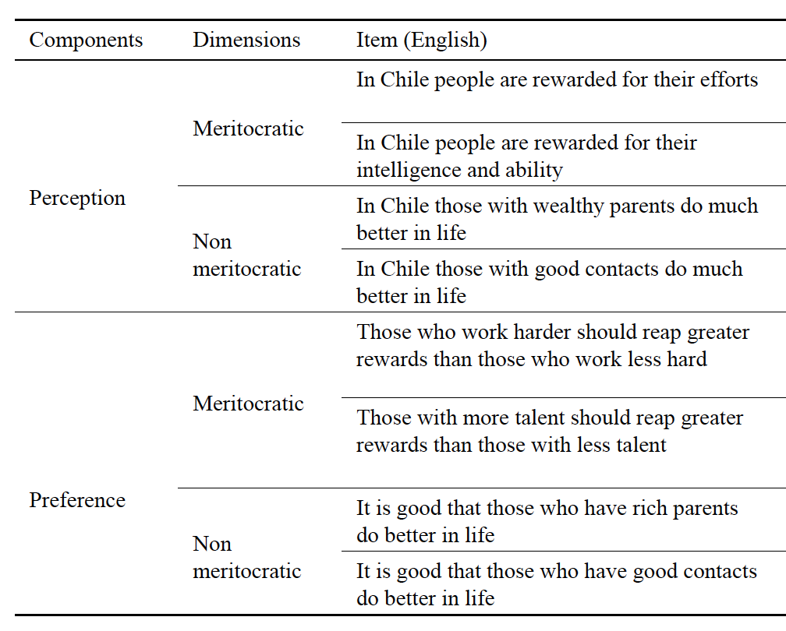{#fig-vars-ppms fig-align='center' width=70%}
:::
:::

::: 


## Measures

::: {.incremental .highlight-last style="font-size: 120%;"}

- **Cohorts**: To distinguish educational level across waves in the invariance analyses, we use a cohort indicator defined at each wave (primary vs. secondary school).

:::


::: {.fragment style="font-size: 120%;"}


::: {#tbl-cohort .cell .tbl-cap-location-top tbl-cap='Descriptive statistics for cohort level'}
::: {.cell-output-display}
`````{=html}
<table class="table table-striped table-bordered" style="font-size: 23px; margin-left: auto; margin-right: auto;">
 <thead>
<tr>
<th style="empty-cells: hide;border-bottom:hidden;" colspan="3"></th>
<th style="border-bottom:hidden;padding-bottom:0; padding-left:3px;padding-right:3px;text-align: center; " colspan="2"><div style="border-bottom: 1px solid #ddd; padding-bottom: 5px; ">Age</div></th>
<th style="border-bottom:hidden;padding-bottom:0; padding-left:3px;padding-right:3px;text-align: center; " colspan="3"><div style="border-bottom: 1px solid #ddd; padding-bottom: 5px; ">Gender</div></th>
</tr>
  <tr>
   <th style="text-align:left;"> Wave </th>
   <th style="text-align:left;"> Cohort level </th>
   <th style="text-align:right;"> N </th>
   <th style="text-align:right;"> Mean </th>
   <th style="text-align:right;"> SD </th>
   <th style="text-align:right;"> Man </th>
   <th style="text-align:right;"> Women </th>
   <th style="text-align:right;"> Others </th>
  </tr>
 </thead>
<tbody>
  <tr>
   <td style="text-align:left;vertical-align: middle !important;" rowspan="3"> Wave 1 </td>
   <td style="text-align:left;"> Primary </td>
   <td style="text-align:right;"> 406 </td>
   <td style="text-align:right;"> 11.85 </td>
   <td style="text-align:right;"> 0.56 </td>
   <td style="text-align:right;"> 195 </td>
   <td style="text-align:right;"> 191 </td>
   <td style="text-align:right;"> 20 </td>
  </tr>
  <tr>
   
   <td style="text-align:left;"> Secondary </td>
   <td style="text-align:right;"> 440 </td>
   <td style="text-align:right;"> 14.79 </td>
   <td style="text-align:right;"> 0.80 </td>
   <td style="text-align:right;"> 226 </td>
   <td style="text-align:right;"> 195 </td>
   <td style="text-align:right;"> 19 </td>
  </tr>
  <tr>
   
   <td style="text-align:left;"> Total </td>
   <td style="text-align:right;"> 846 </td>
   <td style="text-align:right;"> 13.38 </td>
   <td style="text-align:right;"> 1.63 </td>
   <td style="text-align:right;"> 421 </td>
   <td style="text-align:right;"> 386 </td>
   <td style="text-align:right;"> 39 </td>
  </tr>
  <tr>
   <td style="text-align:left;vertical-align: middle !important;" rowspan="3"> Wave 2 </td>
   <td style="text-align:left;"> Primary </td>
   <td style="text-align:right;"> 319 </td>
   <td style="text-align:right;"> 12.83 </td>
   <td style="text-align:right;"> 0.55 </td>
   <td style="text-align:right;"> 161 </td>
   <td style="text-align:right;"> 145 </td>
   <td style="text-align:right;"> 13 </td>
  </tr>
  <tr>
   
   <td style="text-align:left;"> Secondary </td>
   <td style="text-align:right;"> 343 </td>
   <td style="text-align:right;"> 15.76 </td>
   <td style="text-align:right;"> 0.75 </td>
   <td style="text-align:right;"> 177 </td>
   <td style="text-align:right;"> 158 </td>
   <td style="text-align:right;"> 8 </td>
  </tr>
  <tr>
   
   <td style="text-align:left;"> Total </td>
   <td style="text-align:right;"> 662 </td>
   <td style="text-align:right;"> 14.35 </td>
   <td style="text-align:right;"> 1.61 </td>
   <td style="text-align:right;"> 338 </td>
   <td style="text-align:right;"> 303 </td>
   <td style="text-align:right;"> 21 </td>
  </tr>
</tbody>
</table>

`````
:::
:::


:::

## Analytical strategy

::: {.incremental .highlight-last style="font-size: 120%;"}

- **Confirmatory Factor Analysis (CFA)**:

    * A four-factor latent model estimated with WLSMV [@kline_principles_2023]
    * Model fit cutoffs [@brown_confirmatory_2015]: $\text{CFI or TLI} > 0.95$; $RMSEA < 0.06$; nonsignificant $\chi^2$ ($p > 0.05$), and $\chi^2/df < 3$

::: 


## Analytical strategy

::: {.incremental .highlight-last style="font-size: 110%;"}

- **Measurement invariance**: a set of procedures used to assess the comparability of a measurement model [@vandeschoot_editorial_2015; @putnick_measurement_2016]

- Two types:
  * Between cohorts (primary vs. secondary school) --> @davidov_measurement_2014
  * Longitudinal (two waves; within individuals) --> @liu_testing_2017

- Procedure: four sequentially constrained, hierarchical models
  
    * Configural (same factor structure)
    * Weak (+ equal factor loadings)
    * Strong (+ equal intercepts)
    * Strict (+ equal error variances)
    * Fit cutoffs [@chen_sensitivity_2007]: CFI ($\Delta \geq -0.010$) and RMSEA ($\Delta \geq 0.0$)

:::

# Results {background-color="#491106ff"}

## Measurement model

::: {style="font-size: 110%;"}


::: {.cell .fig-cap-location-top}
::: {.cell-output-display}
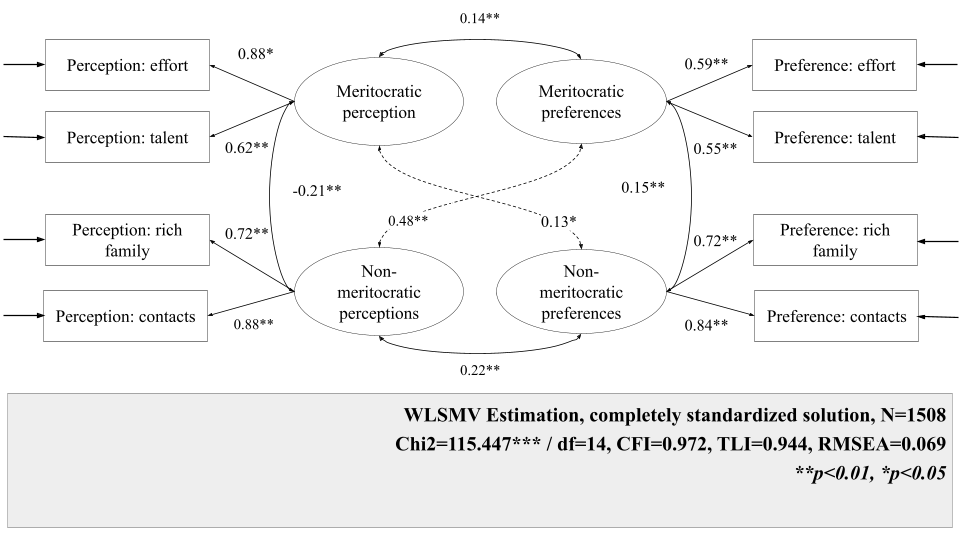{#fig-general width=100% height=auto}
:::
:::

:::

## Longitudinal descriptives


::: {.cell .fig-cap-location-top layout-align="center"}
::: {.cell-output-display}
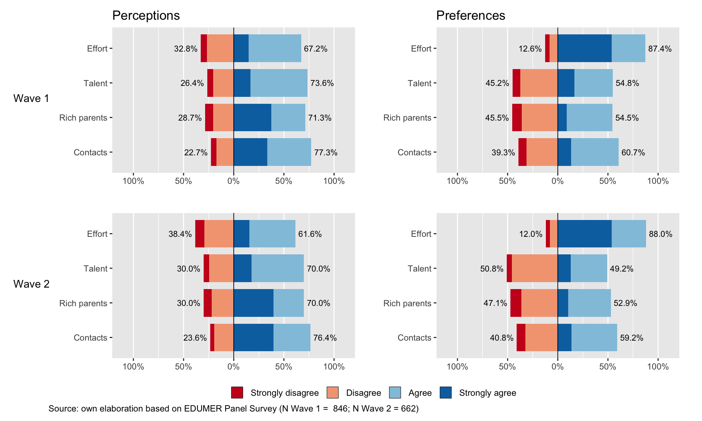{#fig-likerplot1 fig-align='center' width=100%}
:::
:::


## Longitudinal invariance

:::: {style="font-size: 120%;"}


::: {#tbl-longinv .cell .tbl-cap-location-top tbl-cap='Longitudinal invariance results'}
::: {.cell-output-display}
`````{=html}
<table class="table table-striped table-bordered table-condensed" style="font-size: 23px; margin-left: auto; margin-right: auto;">
 <thead>
  <tr>
   <th style="text-align:center;"> Model </th>
   <th style="text-align:center;"> χ^2 (df) </th>
   <th style="text-align:center;"> CFI </th>
   <th style="text-align:center;"> RMSEA (90% CI) </th>
   <th style="text-align:center;"> Δ χ^2 (Δ df) </th>
   <th style="text-align:center;"> Δ CFI </th>
   <th style="text-align:center;"> Δ RMSEA </th>
   <th style="text-align:center;"> Decision </th>
  </tr>
 </thead>
<tbody>
  <tr>
   <td style="text-align:center;width: 2cm; "> Configural </td>
   <td style="text-align:center;"> 117.7 (68) </td>
   <td style="text-align:center;"> 0.991 </td>
   <td style="text-align:center;width: 2 cm; "> 0.035 
 (0.024-0.046) </td>
   <td style="text-align:center;"> 0 (0) </td>
   <td style="text-align:center;"> 0 </td>
   <td style="text-align:center;"> 0.000 </td>
   <td style="text-align:center;"> Reference </td>
  </tr>
  <tr>
   <td style="text-align:center;width: 2cm; "> Weak </td>
   <td style="text-align:center;"> 122.51 (72) </td>
   <td style="text-align:center;"> 0.990 </td>
   <td style="text-align:center;width: 2 cm; "> 0.034 
 (0.024-0.045) </td>
   <td style="text-align:center;"> 4.809 (4) </td>
   <td style="text-align:center;"> 0 </td>
   <td style="text-align:center;"> -0.001 </td>
   <td style="text-align:center;"> Accept </td>
  </tr>
  <tr>
   <td style="text-align:center;width: 2cm; "> Strong </td>
   <td style="text-align:center;"> 128.53 (80) </td>
   <td style="text-align:center;"> 0.991 </td>
   <td style="text-align:center;width: 2 cm; "> 0.032 
 (0.021-0.042) </td>
   <td style="text-align:center;"> 6.02 (8) </td>
   <td style="text-align:center;"> 0 </td>
   <td style="text-align:center;"> -0.002 </td>
   <td style="text-align:center;"> Accept </td>
  </tr>
  <tr>
   <td style="text-align:center;width: 2cm; "> Strict </td>
   <td style="text-align:center;"> 130.17 (84) </td>
   <td style="text-align:center;"> 0.991 </td>
   <td style="text-align:center;width: 2 cm; "> 0.031 
 (0.02-0.04) </td>
   <td style="text-align:center;"> 1.635 (4) </td>
   <td style="text-align:center;"> 0 </td>
   <td style="text-align:center;"> -0.002 </td>
   <td style="text-align:center;"> Accept </td>
  </tr>
</tbody>
</table>

`````
:::
:::


:::: 

## Cohort descriptives


::: {.cell .fig-cap-location-top layout-align="center"}
::: {.cell-output-display}
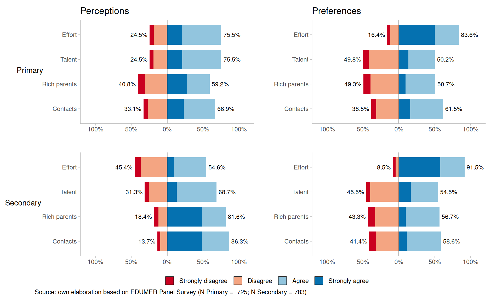{#fig-likerplot2 fig-align='center' width=100%}
:::
:::


## Cohort invariance


:::: {style="font-size: 120%;"}


::: {#tbl-cohort2 .cell .tbl-cap-location-top tbl-cap='Cohort (multigroup) invariance results'}
::: {.cell-output-display}
`````{=html}
<table class="table table-striped table-bordered table-condensed" style="font-size: 23px; margin-left: auto; margin-right: auto;">
 <thead>
  <tr>
   <th style="text-align:center;"> Model </th>
   <th style="text-align:center;"> χ^2 (df) </th>
   <th style="text-align:center;"> CFI </th>
   <th style="text-align:center;"> RMSEA (90% CI) </th>
   <th style="text-align:center;"> Δ χ^2 (Δ df) </th>
   <th style="text-align:center;"> Δ CFI </th>
   <th style="text-align:center;"> Δ RMSEA </th>
   <th style="text-align:center;"> Decision </th>
  </tr>
 </thead>
<tbody>
  <tr>
   <td style="text-align:center;width: 2cm; "> Configural </td>
   <td style="text-align:center;"> 24.95 (26) </td>
   <td style="text-align:center;"> 0.993 </td>
   <td style="text-align:center;width: 2 cm; "> 0.036 
(0.009-0.057) </td>
   <td style="text-align:center;width: 2 cm; "> 0 (0) </td>
   <td style="text-align:center;"> 0.000 </td>
   <td style="text-align:center;"> 0.000 </td>
   <td style="text-align:center;"> Reference </td>
  </tr>
  <tr>
   <td style="text-align:center;width: 2cm; "> Tresholds </td>
   <td style="text-align:center;"> 57.56 (42) </td>
   <td style="text-align:center;"> 0.980 </td>
   <td style="text-align:center;width: 2 cm; "> 0.049 
(0.033-0.064) </td>
   <td style="text-align:center;width: 2 cm; "> 43.875 (16) *** </td>
   <td style="text-align:center;"> -0.013 </td>
   <td style="text-align:center;"> 0.013 </td>
   <td style="text-align:center;"> Reject </td>
  </tr>
  <tr>
   <td style="text-align:center;width: 2cm; "> Tresholds + Loadings </td>
   <td style="text-align:center;"> 72.35 (46) </td>
   <td style="text-align:center;"> 0.973 </td>
   <td style="text-align:center;width: 2 cm; "> 0.053 
(0.039-0.067) </td>
   <td style="text-align:center;width: 2 cm; "> 17.075 (4) ** </td>
   <td style="text-align:center;"> -0.006 </td>
   <td style="text-align:center;"> 0.005 </td>
   <td style="text-align:center;"> Reject </td>
  </tr>
</tbody>
</table>

`````
:::
:::


:::: 

::: {.fragment style="font-size: 120%;"}

Cross-cohort non-invariance is mainly driven by the perceived-effort item, suggesting that older students apply a more critical standard when judging whether effort is rewarded.

:::

# Discussion and conclusions {background-color="#491106ff"}


## Discussion: meritocracy at schools

::: {.incremental .highlight-last style="font-size: 120%;"}

- $H1$ is supported: students already organize meritocratic beliefs into four distinct dimensions

- They distinguish both between “what is” and “what should be,” and between merit and privilege

- Merit and non-merit do not work as opposites: recognizing privilege does not eliminate support for merit [@tang_meritocratic_2025; @mijs_visualizing_2026]

- This suggests that the link between meritocratic beliefs and inequality legitimization is likely dimension-specific [@castillo_multidimensional_2023]

::: 

## Discussion: measurement invariance

::: {.incremental .highlight-last style="font-size: 120%;"}

- $H2$ is supported: the scale is longitudinally stable, so within-student change over time can be interpreted substantively

    * This strengthens the basis for studying developmental change in meritocratic beliefs
    
- $H3$ is not supported: the scale is not fully invariant across educational levels
    
    * Perceived meritocracy seems to shift across school stages, suggesting that older students see effort as less clearly rewarded than younger students do [@tang_meritocratic_2025]

::: 


## Next steps 

::: {.incremental style="font-size: 120%;"}

1. Future research should refine the measure and examine how these beliefs shape school experiences, inequality legitimization, and attitudes toward educational opportunity

2. Start from the items’ covariance structure, and assess whether their relationships form distinguishable clusters.


:::


# Contents {data-background-color="#2f0202" style="text-align: right;"}

<div style="height: 100vh; display: flex; flex-direction: column; justify-content: center; align-items: flex-end; text-align: right;">

- [The project]{style="color: #ab9f9f; font-size: 1.3em;"}
- [Paper market justice in pensions]{style="color: #ab9f9f; font-size: 1.3em;"}
- [Paper factorial invariance of merit scale ]{style="color: #ab9f9f; font-size: 1.3em;"}
- [Latent Class Analysis of merit scale]{style="color: #edde06; font-size: 1.3em;"}

</div>

:::{.notes}

Hello, I am Tomás Urzúa, I am a research assisstant of the project and today I am going to present a working paper that we are d**i**veloping about a Latent Class Analysis of meritocratic beliefs in Chile.

:::

## So far

:::{.incremental .highlight-last}

- Meritocracy as factor associated: relationships with market justice preferences, redistributive preferences and perceptions of inequality.

- Measurement of meritocracy: developed scale that allows for an understanding of meritocratic beliefs from a multidimensional approach

- **Key findings**

  - Meritocracy is not one-dimensional 

  - Nor does it follow a continuous logic 

- **Blind spots**

  - Variable-centered instead of person-centered approaches

  - It is not possible to determine whether people hold different meritocratic beliefs and how they form groups based on their similarities and differences

:::

:::{.notes}

Well, our agenda on meritocratic beliefs has focused primarily on two areas: 

f{e}rst, understand the relationship between meritocracy and attitudes such as preferences for market justice, redistributive preferences, and perceptions of inequality 

and second, in the area of measurement, we have d**i**veloped a scale that allows us to understand meritocratic beliefs from a multidimensional perspective

Based on this, we have found evidence such as

The scale has been validated in a metric way **and** in differents populations as adults and s**tiu**dents. In this frame, we found that they can differ between percepcions and preferen**ces**


Secondly, we have observed that people may feel they prefer society to be organized according to meritocratic ideals as well as non-meritocratic ones. In other words, elements that appear to be óppo**sit**s, can actually coexist 

However, we have identified some blind spots in our research.

Much of our work has focused on variable-based methods, which has a number of implications for the scope and interpretation of the results. The most important limitation is that we don’t know what are the most probable combinations of meritocratics perceptions and preferences in the population


**Aa**nd this is possible thanks to the multidimensional meritocracy scale

In this regard, we have a multidimensional tool that still holds explanatory potential, but which has not yet been f**Ü**lly explored

:::

## Objective of this paper

<br>

::: {.box-inv-4 .sp-after .fragment style="font-size: 45px"}
Examine the patterns of meritocratic and non-meritocratic beliefs and identify different groups and their size based on the meritocratic beliefs configurations
:::

:::{.notes}

Examine the patterns of meritocratic and non-meritocratic beliefs and **ai**dentify different groups and their size based on the meritocratic beliefs configurations

:::

## Data

:::{.incremental .highlight-last style="font-size: 40px;"}
- Dataset: EDUMERCO (2024)

- Online survey (CAWI) applied to Adults in the Metropolitan Region of Chile

- Sampling: Non-probability quota-based design

- Analytical sample: N = 2,740
:::

:::{.notes}

The data we used for this study comes from the EDUMERCO dataset, which is an online survey (CAWI) applied to ád**o**lts in the Metropolitan Region of Chile.

 The sampling method was a non-probability quota-based design, and our analytical sample consists of two thousand seven houndred fourty respondents

:::

## Method

:::{.incremental .highlight-last style="font-size: 30px;"}

- Latent Class Analysis (LCA): It is a statistical method that models the relationships between observed variables based on the assumption that an unobserved categorical latent variable explains their underlying structure

- LCA is specifically used for studies involving categorical or ordinal variables

- Exploratory and confirmatory utility

  - allows for the identification of different types of groups based on the probability that they will give similar responses

  - allows for the testing of hypotheses regarding the number and size of existing groups in society

:::

:::{.notes}

We use latent class analysis, which allows us to model observed variables based on the assumption that an **an**observed categorical latent variable explains their underlying structure 

This method is used for studies involving categorical or ordinal variables, and it has both exploratory and confirmatory utility.

 It allows us to identify different types of groups of people based on the probability that they will give similar responses, and also to test hypotheses regarding the number and size of existing groups in society

:::

## Parameters and estimation

:::{.incremental .highlight-last style="font-size: 30px;"}

- **Parameters**

  - Class probability: Indicates the probability of belonging to each class and reflects the relative size of the group

  - Conditional response probabilities: These indicates the probability of endorsing a particular response category, given membership in a latent class. These parameters are used to interpret and label the classes.

<br>

- **Estimation and fit**

  - Bayesian Information Criteria (BIC)
  - Akaike Information Criteria (AIC)

:::

# Results

:::{.notes}
and now, let's move on to the results
:::

##


::: {.cell .fig-cap-location-bottom layout-align="center"}
::: {.cell-output-display}
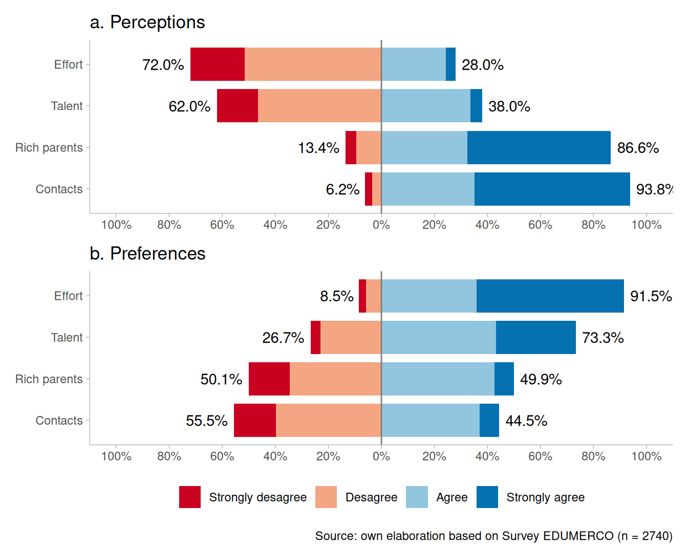{#fig-likert fig-align='center' width=80%}
:::
:::


:::{.notes}

here we have the distribution of responses on the scale, and we can see that in the perceptions dimension, the people perceive higher levels of non-meritocracy than meritocracy elements in society. 


whereas, in the preferences dimension we can see the opposite

:::


##


::: {.cell .fig-cap-location-bottom layout-align="center"}
::: {.cell-output-display}
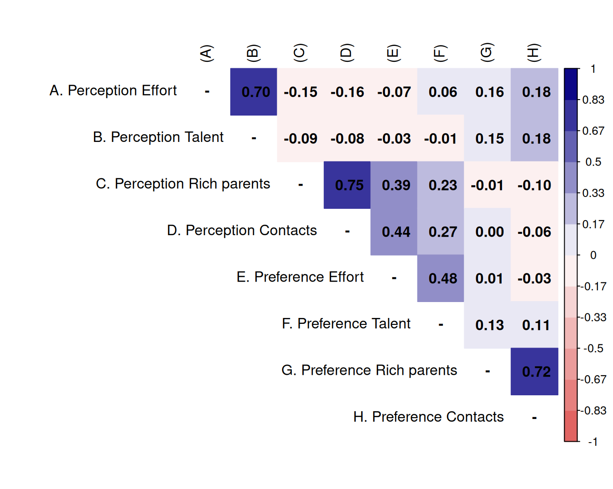{#fig-corr fig-align='center' width=80%}
:::
:::


:::{.notes}

regard the correlation matrix, we can see that the strongest correlations are between the indicators that belong to the same latent factor. 

:::

## 


::: {.cell .fig-cap-location-bottom layout-align="center"}
::: {.cell-output-display}
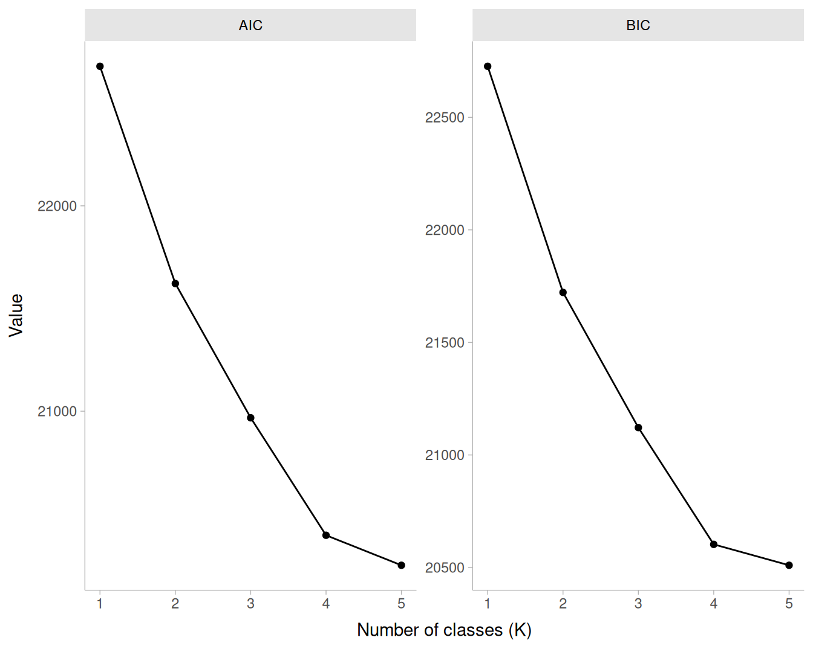{#fig-fit fig-align='center' width=80%}
:::
:::


:::{.notes}

Here we can see the fit indices for the different models we estimated

and the Model fit impr**u**ved significantly as the number of classes increased, as indicated by decreasing **EiAiCi (AIC)** and BIC values

However, the incremental improvement in fit became substantially smaller after the four-class solution. Thus, although the five-class model fit the data slightly better in statistical terms, the gain was comparatively limited. 

Therefore, we selected the four-class solution as the most parsimonious and interpretable model.


:::

## 

:::{.incremental}

::: {.cell .fig-cap-location-bottom layout-align="center"}
::: {.cell-output-display}
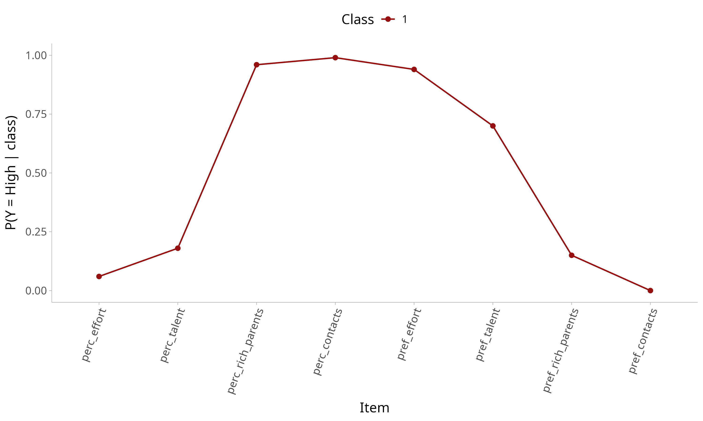{#fig-lca-1 fig-align='center' width=70%}
:::
:::


:::{style="font-size: 24px;"}
- [Class 1 Critical Meritocrats]{style="color: #961010;"} (36.2%): This group is characterized by its belief in meritocracy as a moral ideal, while acknowledging that, in reality, certain privileges influence success. It does not consider the current system to be meritocratic, but it **strongly advocates for it to be so**
:::

:::

:::{.notes}

Now i want to show you a serie of graphs that illustrate the conditional probabilities for each of the four classes one by one.

Starting with the f{e}rst class, it combines a low perception of meritocracy with a high perception of the influence of privilege. Its members believe that success does not depend on effort and talent, but rather on factors such as social background and networks. However, at the normative level, they strongly support meritocracy and reject the le**gí**timacy of non-meritocratic advantages, especially those linked to personal connections.

the name of this class is critical meritocrats and has a size of 36% This group is cháracterized by its belief in meritocracy as a moral **ai**deal, while acknowledging that, in reality, certain prívileges influence success. It does not consider the current system to be meritocratic, but it **strongly ádvocats for it to be so**

:::

## 

:::{.incremental}

::: {.cell .fig-cap-location-bottom layout-align="center"}
::: {.cell-output-display}
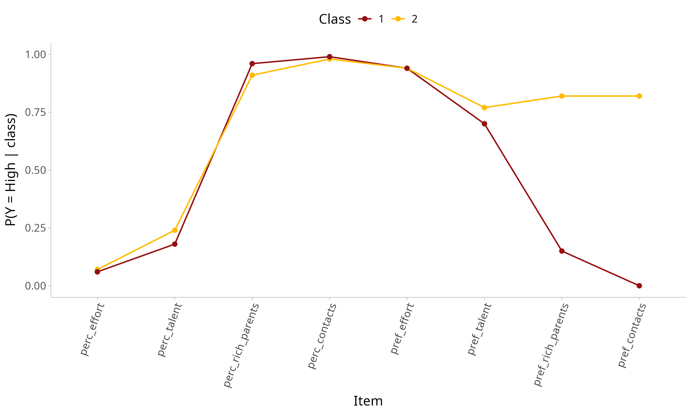{#fig-lca-2 fig-align='center' width=70%}
:::
:::


:::{style="font-size: 24px;"}
- [Class 2: Anything goes]{style="color: #ffbb00;"} (36.3%): This class combines a realistic assessment of a stratified society with a normative justification of privilege. Thus, meritocracy is not presented as an alternative to privilege; rather, **the two principles coexist** and are viewed as compatible foundations for the functioning of society.
:::
:::


:::{.notes}

The second class follows the same descriptive framework as the first, perceiving low levels of meritocratic functions and high levels of non-meritocratic indicators. The main difference lies in the fact that this class accepts that society operates according to norms based on family background and social capital.

This class is called Anything goes and has a size of 36%, combines a realistic assessment of a stratified society with a normative justification of privilege. Thus, meritocracy is not presented as an alternative to privilege; rather, **the two principles coexist** and are viewed as compatible foundations for the functioning of society.

:::


## 

:::{.incremental}

::: {.cell .fig-cap-location-bottom layout-align="center"}
::: {.cell-output-display}
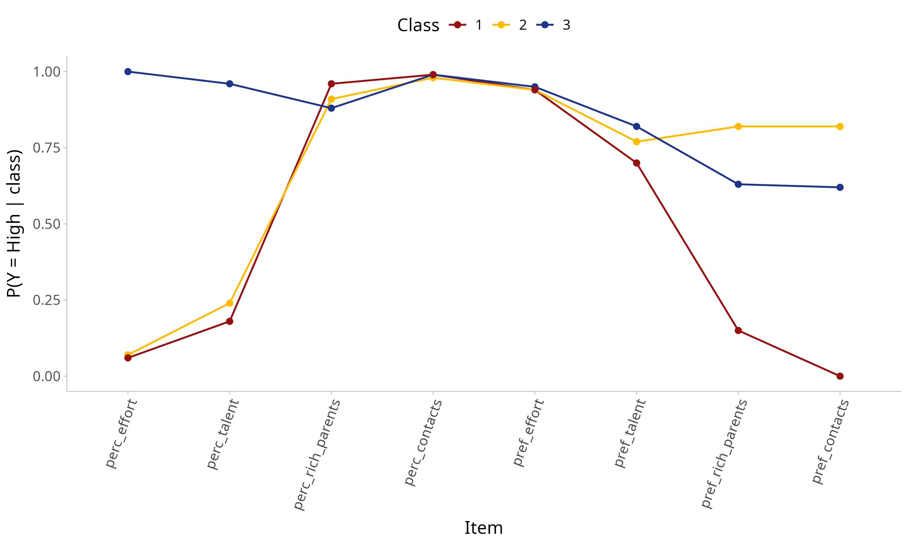{#fig-lca-3 fig-align='center' width=70%}
:::
:::


:::{style="font-size: 24px;"}
- [Class 3 Structurally Aware Meritocrats]{style="color: #1e358a;"} (20.7%): This profile reflects a belief system in which merit and privilege operate simultaneously. They strongly support meritocracy, though they hold an ambivalent stance toward privilege: they view it as less legitimate than other groups do, but they **do not reject it entirely**

:::
:::

:::{.notes}

Now, as we can see, people in the th**e**rd group recognize both meritocratic and non-meritocratic elements in society, which sets them apart from the previous two groups. And  normatively, they strongly endorse meritocracy, while taking a more ambivalent stance toward privilege, but they still show support for non-meritocracy

- This class is called Structurally Aware Meritocrats and has a size of 21%. This profile reflects a belief system in which merit and privilege operate simultaneously. They strongly support meritocracy, though they hold an ambivalent stance toward privilege: they view it as less legitimate than other groups do, but they **do not reject it entirely**, considering the system to be partially meritocratic and acceptable.

:::

##

:::{.incremental}


::: {.cell .fig-cap-location-bottom layout-align="center"}
::: {.cell-output-display}
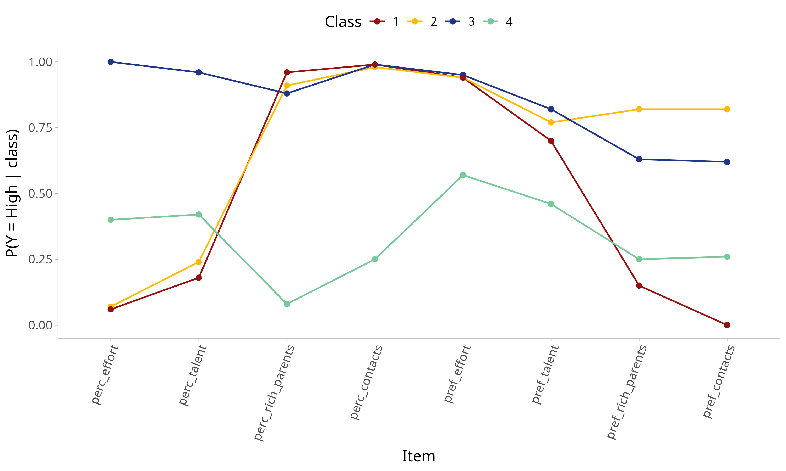{#fig-lca-4 fig-align='center' width=70%}
:::
:::


:::{style="font-size: 30px;"}
  - [Class 4 Neutral naives]{style="color: #78c99a; font-size: 28px;"} (6.8%): This group exhibits an **ambivalent character** as they do not strongly support meritocracy neither non-meritocracy
:::

:::

:::{.notes}

Finally, the fourth class is the smallest with 6% and is characterized by a low perception of meritocracy and a low perception of the influence of privilege, specially the rich parents item. In the same logic, This group does not have a clear preference regarding the values that should guide society, as they do not strongly support meritocracy nor do they clearly recognize the significance of privilege
:::


## Next steps

:::{.incremental .highlight-last style="font-size: 34px;"}
- Delving deeper into the interpretation of the lessons: find a more substantive explanation for the ambivalent class and connecting the findings to the literature

<br>

- Estimate regressions using latent classes as independent variables to predict support for market-based justice in social services
:::

:::{.notes}

Finally, we are currently working on delving deeper into the interpretation of the classes, finding a more substantive explanation for the fourth class and connecting the findings to the l**ít**erature

And we are thinking to estimate regressions using latent classes as independent variables to predict support for market-based justice in social services such as health, pensions and education

:::


::::

# Thanks you for your attention {background-color="#491106ff"}

- **Website:** [https://jus-mer.github.io/web-proyecto/docs/](https://jus-mer.github.io/web-proyecto/docs/)
- **Github project:** <https://github.com/jus-mer>

:::{=html}
<div style="text-align: center; margin-top: 30px;">
  
</div>
:::


## References

::: {#refs}
:::


# Supplementary Material {background-color="#491106ff"}


## Bivariate

::: {.cell .fig-cap-location-bottom}
::: {.cell-output-display}
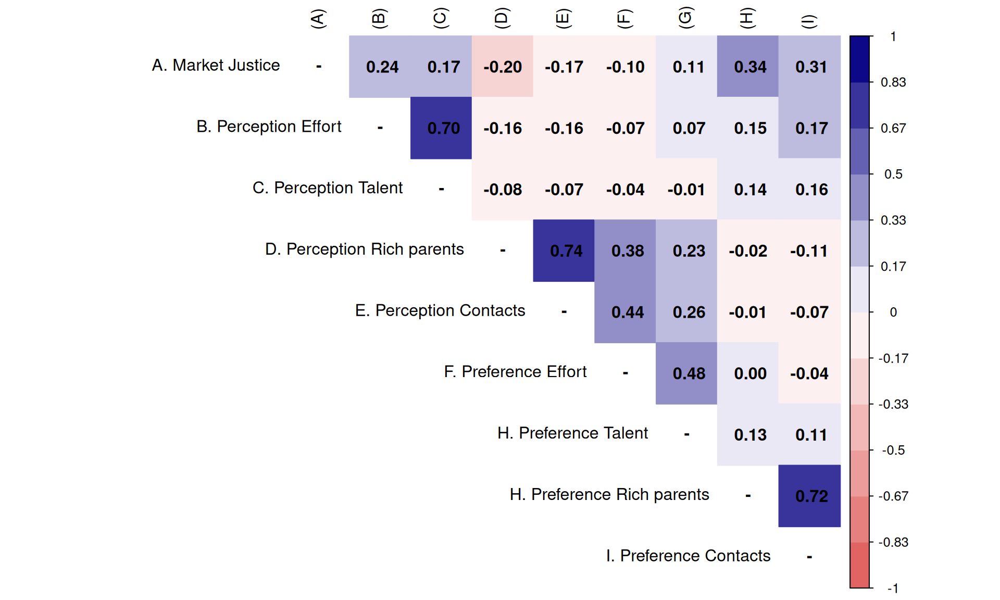{#fig-cor width=90%}
:::
:::


## MIMIC Model: Education


::: {.cell .fig-cap-location-bottom layout-align="center"}
::: {.cell-output-display}
{#fig-educ fig-align='center' width=100%}
:::
:::


## MIMIC Model: Healthcare


::: {.cell .fig-cap-location-bottom layout-align="center"}
::: {.cell-output-display}
{#fig-health fig-align='center' width=100%}
:::
:::


