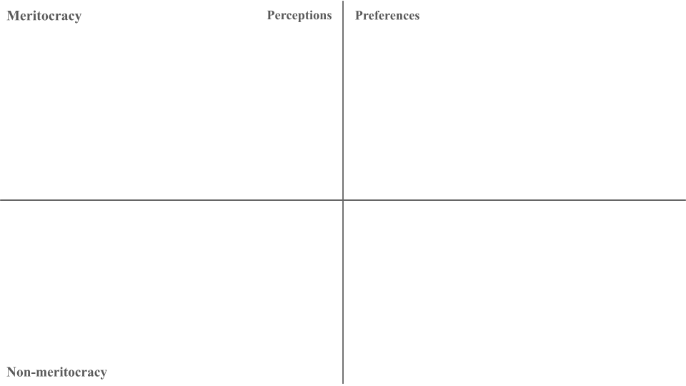
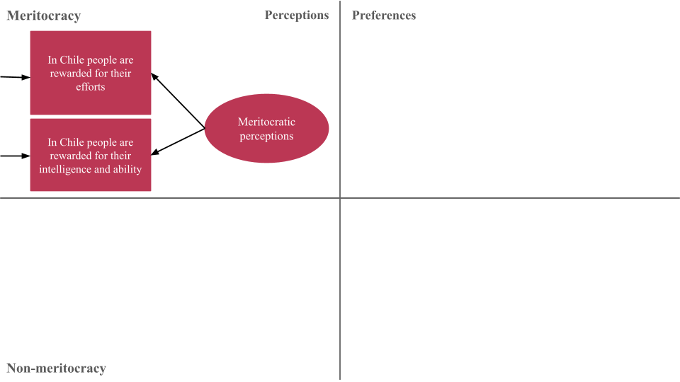
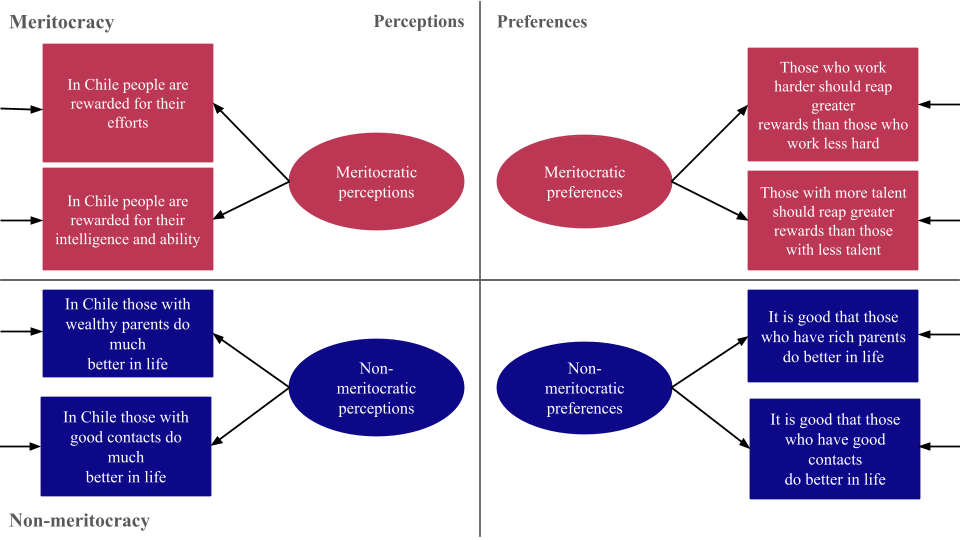
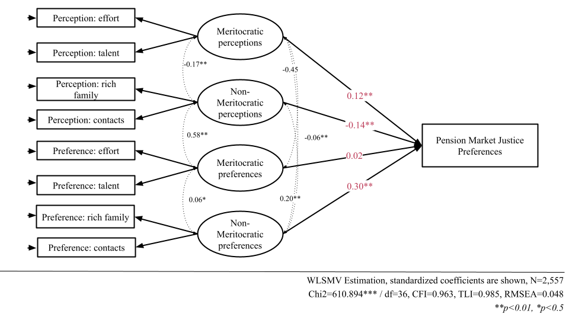

# Pension market justice and multidimensional meritocratic beliefs {background-color="#491106ff"} 

<p style="color: white; font-size: 1.5em; text-align: right;">(Work in progress)</p> 

```{r}
#| echo: false
#| include: false
library(here)
source("prod_analysis_sem.R")
```

::: {.notes}

Thank you, Juan Carlos.

Regarding the last ˈkavēˌät, we conducted an additional analysis using a multidimensional measurement model of meritocratic beliefs for survey research, developed by Juan Carlos and other team members, including Julio, who is here in the audience. The goal of this analysis is to iɡˈzamən how different dimensions of meritocratic beliefs relate to pension market justice.

This is still a work in progress, and we would be very glad to hear your feedback.


:::

## Multidimensional framework of meritocracy

::: {.fragment}

```{r}
#| fig-cap: "Castillo et al. (2023) measurement model"
#| fig-align: center
#| out-width: '100%'
#| fig-cap-location: bottom
library(knitr)
library(here)



```

:::

::: {.notes}

To approach meritocracy, we use a multidimensional framework. This model expands the usual way meritocracy is measured in empirical research.

:::
## Multidimensional framework of meritocracy


```{r}
#| fig-cap-location: bottom
#| fig-cap: "Castillo et al. (2023) measurement model"
#| fig-align: center
#| out-width: '100%'




```

::: {.notes}

Most studies focus only on meritocratic perceptions, that is, whether people believe that effort and ability are actually rewarded in society. This is represented in the upper-left corner of the diagram. 
 

:::

## Multidimensional framework of meritocracy


```{r}
#| fig-cap-location: bottom
#| fig-cap: "Castillo et al. (2023) measurement model"
#| fig-align: center
#| out-width: '100%'


knitr::include_graphics("images/diagramas(2).png")
```

::: {.notes}
What this model adds is, first, a distinction between perceptions and preferences, where perceptions refer to how people think society works and preferences refer to how they think it should work. This is represented in the upper-right corner using the same items, but with a normative sense. 
:::

## Multidimensional framework of meritocracy


```{r}
#| fig-cap-location: bottom
#| fig-cap: "Castillo et al. (2023) measurement model"
#| fig-align: center
#| out-width: '100%'



```


::: {.notes}
Second, it also incorporates non-meritocratic elements, captured through items on family wealth and social connections, both shown at the bottom of the diagram. We call this dimension non-meritocratic privilege.


:::

## Multidimensional framework of meritocracy


```{r}
#| fig-cap-location: bottom
#| fig-cap: "Castillo et al. (2023) measurement model"
#| fig-align: center
#| out-width: '100%'


knitr::include_graphics("images/diagramas(4).png")
```

::: {.notes}
So, in total, the scale distinguishes four dimensions: perceived meritocracy, perceived non-meritocracy, preference for meritocracy, and preference for non-meritocracy. This means that recognizing privilege does not negate support for merit. Both can coexist within the same belief system in terms of perceptions and preferences.

Also, you can see the two items for each factor, all measured on a four-point agreement scale.

:::

## Data

:::: {.incremental style="font-size: 120%;"}

- EDUMERCO: Online survey (CAWI), fielded in 2025, with adult respondents from the Metropolitan Region of Chile  

- Non-probability sample with quota-based design  
    → approximating population parameters by age, gender, education, and socioeconomic status  

- Total sample: N = 3,470  

- Analytical sample: **N = 2,557** 

:::: 

::: {.notes}

For this analysis, we use data from an online CAWI survey conducted in two thousand twenty-five among adults in the Metropolitan Region of Chile. The resulting analytical sample consisted of two thousand five hundred and fifty-seven individuals.

:::


## Analytical strategy

:::: {.incremental style="font-size: 120%;"}

- First, we estimate a Confirmatory Factor Analysis of the multidimensional meritocracy scale  
  → good model fit (CFI = 0.995, TLI = 0.991, RMSEA = 0.048)

- Second, we estimate a Structural Equation Model  
  → pension market justice regressed on latent meritocracy factors

::: {.fragment}
$$
\text{MJP}_{i} = \alpha + \beta_1 \eta^{PM}_{i} + \beta_2 \eta^{PNM}_{i} + \beta_3 \eta^{PrM}_{i} + \beta_4 \eta^{PrNM}_{i} + \gamma'X_i + \varepsilon_i
$$
:::

- Estimation: WLSMV  
  → appropriate for ordinal (Likert-type) data [@kline_principles_2023]

:::: 

::: {.notes}

Methodologically, we prəˈsēd in two steps. First, we estimate a confirmatory factor analysis of the multidimensional scale, which showed a good fit to the data. This adds evidence in line with the latent structure of the scale. 

Second, we estimate a structural equation model in which pension market justice is regressed on the latent meritocracy factors. This allows us to model the covariance among the items, recover the underlying dimensions of meritocratic beliefs, and estimate how each of them relates to support for market justice. Formally, the outcome is modeled as a function of the scale's four latent dimensions, along with the same controls as in the main paper. 


:::

# Results {background-color="#491106ff"}

## Descriptive

```{r}
#| label: fig-likermerit
#| fig-cap-location: bottom
#| fig-cap: "Distribution of responses on the scale of perceptions and preferences regarding meritocracy"
#| out-width: '90%'
#| echo: false
#| fig-asp: 0.6

likerplot 
```

::: {.notes}

Here we see the distribution of responses for the meritocracy scale items, separating perceptions from preferences. The descriptive pattern suggests that respondents tend to perceive effort and talent as not strongly rewarded, whereas family wealth and social connections are. NOR-mə-tiv-lee, however, they prefer effort—and to a lesser extent talent—to be rewarded, while attitudes toward non-meritocratic ad-VAN-tih-jiz are more divided. 

These results suggest that Chileans largely see privilege as more decisive than merit, even dou effort remains the ideal they most strongly support. 


:::

## Model


```{r}
#| label: fig-sem
#| fig-align: center
#| out-width: '100%'
#| echo: false
#| fig-asp: 0.6
#| fig-cap-location: bottom
#| fig-cap: "Structural equation model"




```

::: {.notes}

The structural equation model reveals a different picture. First, consistent with our previous paper, perceiving society as meritocratic is associated with greater support for pension market justice. We see this as an important replication, because with different data and a different technique, we find the same substantive pattern.

But once we treat meritocratic beliefs as multidimensional, new findings appear.

Perceiving society as non-meritocratic is associated with lower support for pension market justice. A possible interpretation is that seeing society as shaped by privilege rather than merit may increase awareness of inequality and reduce its justification in domeins such as pensions.
By contrast, we haven’t found an effect for preferences for meritocracy, perhaps because this factor has little variation, as most people normatively support meritocratic principles.

Finally, the most striking result, in our view, is that stronger support for non-meritocratic ad-VAN-tij is associated with higher support for pension market justice. We think it might be related to embracing privilege, but this is a new finding, and we look forward to discussing it with you.

Overall, this analysis suggests that it is not enough to talk about meritocracy in general. Its different dimensions matter, and they do not all work in the same way.

With that, I hand it back to Juan Carlos for the concluding remarks.


:::
