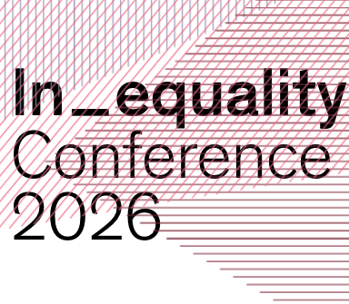

```{r}
#| include: false
library(knitr)
knitr::opts_chunk$set(echo = F,
                      warning = F,
                      error = F, 
                      message = F) 
```

```{r}
#| include: false

if (! require("pacman")) install.packages("pacman")

pacman::p_load(tidyverse, 
               here,
               kableExtra)

options(scipen=999)
rm(list = ls())
```


::: columns


::: {.column width="20%"}


{width='80%'}

{width='75%'}

{width='80%'}

:::

::: {.column .column-right width="80%"}


# Justification trajectories for pension inequality in Chile (2016–2023) {style="font-size:21px; text-align:right; line-height:1.1;"}

### **The role of social class and beliefs in meritocracy**{style="font-size:35px; text-align:right; line-height:1.1; margin-top:12px;"}

------------------------------------------------------------------------

</br>
**Juan Carlos Castillo, Andreas Laffert, René Canales & </br> Tomás Urzúa**

::: {.blue2 .medium style="line-height:0.4; margin-top:0; margin-bottom:0;"}

**Department of Sociology, University of Chile** </br>

:::

</br>

### In_equality Conference | Panel 17: Meritocracy and Inequality Beliefs - April 2026, Universität Konstanz {style="color:black"}

:::
:::

::: {.notes}
Good morning everyone, I am Juan Carlos Castillo, and I am here to present our research on justification trajectories for pension inequality in Chile from 2016 to 2023. This study focuses on the role of social class and beliefs in meritocracy. The research was conducted in collaboration with my colleagues Andreas Laffert, René Canales, and Tomás Urzúa, all from the Department of Sociology at the University of Chile.  
:::











# References

::: {#refs}
:::

